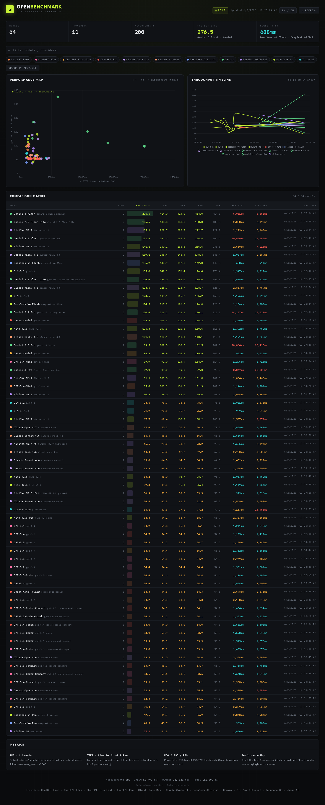

# OpenBenchmark

[](.github/workflows/benchmark.yml)
[](LICENSE)
[](https://openbenchmark.pages.dev)
[](https://nodejs.org)


**English** · [中文说明](#中文说明)

> Multi-provider LLM inference benchmark — a **static, self-updating dashboard** that measures and compares **throughput (TPS)** and **latency (TTFT)** across LLM API providers.



OpenBenchmark runs the *same* fixed task against every model you configure, records **tokens/second** and **time-to-first-token**, and publishes a fast, filterable comparison dashboard to **Cloudflare Pages** — kept up to date automatically by a scheduled CI job.

There is **no server and no database to operate**: the data lives as append-only NDJSON in the repo (git *is* the database), and the published site is 100% static.

## Features

- 📊 **Performance Map** — a TTFT × TPS scatter plot; the **top-left** corner is the sweet spot (low latency + high throughput).
- 🔬 **Comparison matrix** — every column is sortable, so you can rank the *same* model across different providers/routes (e.g. GPT‑5.5 on four ChatGPT tiers, Claude across AWS/Windsurf/Max).
- 🔎 **Provider filter chips + model search** — every view reacts live.
- 🎯 **Selection** — click a point or row to highlight a model across all views and isolate it in the timeline.
- 📈 **Throughput timeline** — auto-capped to the fastest N models so it never turns into spaghetti.
- 🌐 **Bilingual UI** (English / 中文), auto-detected from the browser.
- 🤖 **Hands-off** — a CI runner re-benchmarks on a schedule, commits the data, rebuilds, and redeploys.
- 🔒 **Secret-safe** — API keys live only in environment variables / CI secrets. There are no hardcoded keys, and the deployed artifact contains no secrets.
- 🪶 **Zero runtime dependencies** — only Node's built-ins (`fetch`, `fs`, `http`).

## How it works

```
┌─ CI runner (hourly cron) ────────────────────────────────┐
│  node benchmark.js   → append data/results.ndjson         │
│  git commit & push   → history persists in the repo       │
│  node build.js       → dist/ (index.html + data/*.json)   │
│  wrangler pages deploy dist  → Cloudflare Pages (static)  │
└───────────────────────────────────────────────────────────┘
```

| File | Role |
| --- | --- |
| `benchmark.js` | Streams a fixed prompt to every configured model, measuring TTFT & TPS. Keys from env only. |
| `data/results.ndjson` | Single source of truth — one JSON record per run, append-only, pruned to `RETENTION_DAYS`. |
| `lib/stats.js` | Shared aggregation (per-model means, P50/P95/P99, timeseries). |
| `build.js` | NDJSON → `dist/`: the static front-end + pre-rendered JSON the dashboard fetches. |
| `public/index.html` | The dashboard (Chart.js + vanilla JS). |
| `server.js` | Zero-dependency static server for local preview. |

Only `dist/` is uploaded to Pages, so secrets never reach the public site.

## Quick start (local)

Requires **Node ≥ 20.6** (uses built-in `fetch` and `--env-file-if-exists`).

```bash
git clone https://github.com/<you>/openbenchmark.git
cd openbenchmark
cp .env.example .env        # fill in at least one provider key
npm run benchmark           # run one round → writes data/results.ndjson
npm run dev                 # build + serve → http://localhost:3456
```

| Command | What it does |
| --- | --- |
| `npm run benchmark` | Run the benchmark once (auto-loads `.env`). |
| `npm run build` | Generate `dist/` from `data/results.ndjson`. |
| `npm run serve` | Serve `dist/` locally. |
| `npm run dev` | Build + serve. |
| `npm run stats` | Print a summary table to the terminal (`node stats.js --json` for raw JSON). |

## Configuration

### Providers & models

Edit the `PROVIDERS` array in **`benchmark.js`**. Each entry:

```js
{
  name: 'OpenCode Go',
  apiBase: CFG.OPENCODE_GO_URL,
  apiKey: CFG.OPENCODE_GO_KEY,
  apiType: 'openai',          // 'openai' (chat/completions) or 'anthropic' (messages)
  serviceTier: 'fast',        // optional — OpenAI service_tier
  models: [
    { id: 'glm-5.1', name: 'GLM-5.1' },
    // ...
  ],
}
```

A provider whose key resolves to empty is **skipped automatically**, so you only test what you configure.

### API keys

Set them in `.env` locally (see [`.env.example`](.env.example)) or as CI secrets. URLs are **not** secret and ship with public defaults — override with the matching `*_URL` variable if you use a different gateway.

### Tuning

| Variable | Default | Meaning |
| --- | --- | --- |
| `RETENTION_DAYS` | `30` | History window kept in `results.ndjson`. `0` = keep everything. |
| `CONCURRENCY` *(in `benchmark.js`)* | `6` | Max parallel requests. |
| 1-hour skip *(built in)* | — | A model successfully measured < 1h ago is skipped that run. |
| `PROMPTS` *(in `benchmark.js`)* | fixed writing task | The benchmark task; identical for every model for a fair comparison. |

---

## Deploy to Cloudflare Pages

The dashboard is static, so any host works — but the CI is wired for **Cloudflare Pages** via `wrangler` (Direct Upload).

### 1 · Create a Cloudflare API token

1. Cloudflare dashboard → **My Profile → API Tokens → Create Token**.
2. Either use the **“Edit Cloudflare Workers”** template, or create a *custom token* with at least:
   - **Account → Cloudflare Pages → Edit**
3. Copy the token. This is your **`CLOUDFLARE_API_TOKEN`**.

### 2 · Find your Account ID

Cloudflare dashboard → **Workers & Pages** (or any domain) → the **Account ID** is shown in the right sidebar. This is your **`CLOUDFLARE_ACCOUNT_ID`**.

### 3 · Name your project

Edit `name` in **`wrangler.toml`** (default `openbenchmark`). It becomes `https://<name>.pages.dev`.

```toml
name = "openbenchmark"
pages_build_output_dir = "dist"
```

### 4 · First deploy (manual, optional)

```bash
export CLOUDFLARE_API_TOKEN=...      # account auto-detected if you have a single account
npm run build
npx wrangler pages project create openbenchmark --production-branch=main
npx wrangler pages deploy dist --project-name=openbenchmark --branch=main
```

It’s now live at `https://openbenchmark.pages.dev`. (Once CI secrets are set, the workflow does this for you on every run.)

### 5 · Custom domain

Cloudflare dashboard → **Workers & Pages → your project → Custom domains → Set up a domain**.

> **Why `wrangler` instead of the Pages Git integration?** Pages’ built-in Git builds work for GitHub/GitLab, but this project commits data back to the repo each run and drives the deploy from CI for full control. Direct Upload also works from any Git host.

---

## Automate with GitHub Actions

The workflow [`.github/workflows/benchmark.yml`](.github/workflows/benchmark.yml) runs on a schedule: **benchmark → commit data → build → deploy**.

### 1 · Add repository secrets

Repo **Settings → Secrets and variables → Actions → New repository secret**:

| Secret | Required | Value |
| --- | --- | --- |
| `CLOUDFLARE_API_TOKEN` | ✅ | From step 1 above. |
| `CLOUDFLARE_ACCOUNT_ID` | ✅ | From step 2 above. |
| `OPENCODE_GO_KEY`, `ZHIPU_API_KEY`, `CHATGPT_FREE_KEY`, `DEEPSEEK_API_KEY`, `GEMINI_API_KEY`, … | per provider | Your API keys — **only add the ones you actually use**. |

The full list of supported key names is in [`.env.example`](.env.example). A provider with no secret is silently skipped.

### 2 · Allow the workflow to push data back ⚠️

Each run commits the updated `data/results.ndjson` back to the repo. Grant write access:

> **Settings → Actions → General → Workflow permissions → select “Read and write permissions” → Save.**

The workflow already declares `permissions: contents: write`, so the built-in `GITHUB_TOKEN` can push — **no personal access token needed**. (This repo setting is the ceiling; if it’s left read-only, the push step fails.)

### 3 · Cost

For **public** repositories, GitHub Actions minutes are **free** — hourly runs cost nothing. Private repos draw from your included minutes.

### 4 · Run it

- **Scheduled** — hourly via the `cron` in the workflow (edit to taste).
- **Manual** — Actions tab → **Benchmark & Deploy → Run workflow**.
- **On push** — any push to `main` (except data-only commits) triggers it too.

> GitHub may delay scheduled runs during peak load, and **disables schedules after 60 days of repo inactivity** — push something or run it manually to re-arm.

That’s it. The dashboard now refreshes itself.

---

## Data format

`data/results.ndjson` — one JSON object per line:

```json
{"provider":"OpenCode Go","model_id":"glm-5.1","model_name":"GLM-5.1","run_at":"2026-06-02 00:36:40","prompt_type":"writing","input_tokens":83,"output_tokens":2048,"total_tokens":2131,"time_to_first_token_ms":1272.86,"total_time_ms":11610.29,"tokens_per_second":176.4,"duration_ms":11610.29,"success":1,"error":null}
```

- `run_at` is UTC `YYYY-MM-DD HH:MM:SS`.
- The build computes per-model means + P50/P95/P99 and the timeline from these records.
- **Reset the history**: empty the file, commit, then re-run —
  ```bash
  : > data/results.ndjson && git commit -am "data: reset" && git push
  # then trigger the workflow (Actions → Run workflow)
  ```

## Metrics

| Metric | Meaning |
| --- | --- |
| **TPS** | Output tokens per second; higher = faster decode. All runs use `max_tokens=2048`. |
| **TTFT** | Time to first token (ms): network round-trip + preprocessing + first token. Drives perceived responsiveness. |
| **P50 / P95 / P99** | Percentiles; the closer to the mean, the more consistent the model. |
| **Performance Map** | Top-left = low latency **and** high throughput = best. |

## Caveats

- TTFT and TPS are measured **from the CI runner’s network location** (GitHub-hosted runners live in the cloud), not from your end users. Read the numbers as *relative* comparisons under one consistent vantage point, not absolute SLAs. For location-accurate numbers, use a self-hosted runner.
- Token counts use the provider’s reported `usage` when present, otherwise a ~4-chars/token estimate.
- Third-party gateway routes can rate-limit or fail intermittently; failed runs are recorded (with the error) but excluded from the stats.

## Project structure

```
benchmark.js                    run benchmarks → data/results.ndjson  (env-only keys)
build.js                        NDJSON → dist/ (static site + data JSON)
lib/stats.js                    shared aggregation (percentiles, timeseries)
server.js                       zero-dep static server for local preview
stats.js                        CLI summary
public/index.html               the dashboard (Chart.js + vanilla JS)
wrangler.toml                   Cloudflare Pages project config
.github/workflows/benchmark.yml scheduled CI (benchmark → commit → build → deploy)
data/results.ndjson             append-only data (git as the database)
```

## Security

- API keys are read **only** from environment variables / CI secrets — there are no hardcoded defaults anywhere in the code.
- `.gitignore` excludes `.env`, `*.db`, and `dist/`.
- Only the built `dist/` is published to Pages; it contains aggregated metrics — no secrets, and no raw upstream error bodies (those are scrubbed before they’re stored and never appear in the published JSON).

## License

[MIT](LICENSE)

---

# 中文说明

> 多供应商 LLM 推理基准测试 —— 一个**静态、自动更新**的看板，跨各家 LLM API 测量并对比**吞吐 (TPS)** 与**延迟 (TTFT)**。

对每个配置的模型跑**同一个固定任务**，记录每秒输出 token 数与首 token 延迟，把可筛选、可对比的看板发布到 **Cloudflare Pages**，并由定时 CI 自动保持更新。**无需服务器、无需运维数据库**：数据以追加式 NDJSON 存在仓库里（git 即数据库），发布的站点是纯静态。

## 功能

- 📊 **性能图谱** —— TTFT × TPS 散点图，**左上角**最优（低延迟 + 高吞吐）；可切换对数刻度。
- 🔬 **对比矩阵** —— 每列可排序，可跨供应商对比同一模型（如 GPT‑5.5 的四个 ChatGPT 档、Claude 的 AWS/Windsurf/Max 路由）；支持 **CSV 导出**当前视图。
- 🔎 **供应商筛选 + 模型搜索** —— 所有视图实时联动。
- 🎯 **选中联动** —— 点击点或表格行，在各视图高亮该模型，并在时间线中单独显示。
- 📈 **吞吐时间线** —— 自动只显示最快 N 个，避免线条糊成一团。
- 🌐 **双语 UI**（中文 / English），按浏览器自动切换。
- 🤖 **全自动** —— CI 定时重跑、回提交数据、重建、重新部署。
- 🔒 **密钥安全** —— key 只存在环境变量 / CI secrets，代码与发布产物均不含密钥。
- 🪶 **零运行时依赖** —— 仅用 Node 内置能力（`fetch`/`fs`/`http`）。

## 工作原理

```
┌─ CI runner（每小时）────────────────────────────────────┐
│  node benchmark.js   → 追加 data/results.ndjson           │
│  git commit & push   → 历史留存在仓库                     │
│  node build.js       → dist/（index.html + data/*.json）  │
│  wrangler pages deploy dist  → Cloudflare Pages（静态）   │
└───────────────────────────────────────────────────────────┘
```

只有 `dist/` 被上传到 Pages，密钥永不进入公开站点。

## 本地使用

需 **Node ≥ 20.6**（用到内置 `fetch` 与 `--env-file-if-exists`）。

```bash
git clone https://github.com/<你>/openbenchmark.git
cd openbenchmark
cp .env.example .env        # 至少填一个供应商 key
npm run benchmark           # 跑一轮 → 写入 data/results.ndjson
npm run dev                 # 构建 + 本地预览 → http://localhost:3456
```

| 命令 | 作用 |
| --- | --- |
| `npm run benchmark` | 跑一轮基准（自动加载 `.env`）。 |
| `npm run build` | 由 `data/results.ndjson` 生成 `dist/`。 |
| `npm run serve` | 本地静态服务 `dist/`。 |
| `npm run dev` | 构建 + 服务。 |
| `npm run stats` | 终端打印汇总表（`node stats.js --json` 输出原始 JSON）。 |

## 配置

**供应商 / 模型**：编辑 `benchmark.js` 的 `PROVIDERS` 数组（`apiType` 为 `openai` 或 `anthropic`；无 key 的供应商自动跳过）。
**API key**：本地写进 `.env`（见 `.env.example`），CI 写进 secrets。URL 非机密，自带公开默认值，可用 `*_URL` 覆盖。
**调优**：`RETENTION_DAYS`（默认 30，历史保留天数；0=全留）、`CONCURRENCY`（默认 6）、1 小时内已测过的模型自动跳过。

## 部署到 Cloudflare Pages

1. **建 API Token**：Cloudflare → 我的资料 → API 令牌 → 创建令牌；用「编辑 Cloudflare Workers」模板，或自定义含 **账户 → Cloudflare Pages → 编辑** 权限。得到 `CLOUDFLARE_API_TOKEN`。
2. **取 Account ID**：Cloudflare → Workers & Pages 右侧栏的账户 ID，即 `CLOUDFLARE_ACCOUNT_ID`。
3. **命名项目**：改 `wrangler.toml` 的 `name`（默认 `openbenchmark`），即 `https://<name>.pages.dev`。
4. **首次手动部署**（可选）：
   ```bash
   export CLOUDFLARE_API_TOKEN=...
   npm run build
   npx wrangler pages project create openbenchmark --production-branch=main
   npx wrangler pages deploy dist --project-name=openbenchmark --branch=main
   ```
5. **绑定域名**：Cloudflare → 你的 Pages 项目 → 自定义域。

> 为什么用 `wrangler` 而非 Pages 的 Git 集成？因为本项目每次跑完要把数据回提交进仓库，并由 CI 主导部署以获得完全控制；Direct Upload 也兼容任意 Git 平台。

## 用 GitHub Actions 自动化

工作流 `.github/workflows/benchmark.yml` 定时执行：**跑基准 → 回提交数据 → 构建 → 部署**。

1. **加仓库 secrets**：Settings → Secrets and variables → Actions：
   - `CLOUDFLARE_API_TOKEN`、`CLOUDFLARE_ACCOUNT_ID`（必需）
   - 各供应商 key（`OPENCODE_GO_KEY`、`ZHIPU_API_KEY` …，只加你用的；完整名单见 `.env.example`）
2. **⚠️ 允许工作流回写仓库**：Settings → Actions → General → Workflow permissions → 选 **「Read and write permissions」** → 保存。（这样内置 `GITHUB_TOKEN` 才能 push 回数据，**无需 PAT**。该仓库设置是上限，若设为只读则 push 步骤会失败。）
3. **费用**：**公开**仓库的 Actions 分钟数**免费**，每小时跑也不花钱；私有仓库消耗额度。
4. **触发**：定时 cron（可改）/ Actions 页手动 Run workflow / 推送到 `main`。
   > GitHub 在仓库 60 天无活动后会停用定时任务，推一次或手动跑即可重新激活。

## 数据格式

`data/results.ndjson` 每行一条 JSON（`run_at` 为 UTC `YYYY-MM-DD HH:MM:SS`）。**重置历史**：清空文件、提交、再跑：
```bash
: > data/results.ndjson && git commit -am "data: reset" && git push   # 然后到 Actions 手动 Run workflow
```

## 指标

| 指标 | 含义 |
| --- | --- |
| **TPS** | 每秒输出 token 数，越高解码越快（统一 `max_tokens=2048`）。 |
| **TTFT** | 首 token 延迟（ms）：网络往返 + 预处理 + 首 token，决定交互响应感。 |
| **P50/P95/P99** | 百分位，越接近均值越稳定。 |
| **性能图谱** | 左上 = 低延迟 + 高吞吐 = 最优。 |

## 局限

- TTFT/TPS 是**从 CI runner 所在网络位置**测得（GitHub 托管 runner 在云端），不代表你终端用户的体验；请将数值理解为**同一观测点下的相对对比**，而非绝对 SLA。需精确位置可用自托管 runner。
- token 数优先用供应商返回的 `usage`，否则用 ~4 字符/token 估算。
- 第三方中转可能限流/间歇失败；失败记录会保留（含错误）但不计入统计。

## 安全

- API key 仅来自环境变量 / CI secrets，代码中无任何硬编码默认值。
- `.gitignore` 排除 `.env`、`*.db`、`dist/`。
- 仅构建后的 `dist/` 发布到 Pages；只含聚合指标，不含密钥，也不含原始上游错误体（写入前已脱敏，且不进入发布的 JSON）。

## 许可

[MIT](LICENSE)
